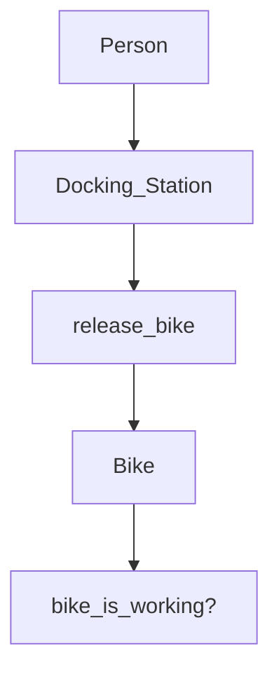

# Boris Bikes

Transport for London wish to create a new bike system, this program will emulate all the docking stations, bikes, and infrastructure.

## Getting started

`git clone path-to-your-repo`
`command_to_install_dependencies` (e.g. `bundle`)

## Usage

`command_to_start` (e.g. `rackup` or `rails s`)
Navigate to `http://localhost:4567/`

## Running tests

`test_command` (e.g. `rspec`)

User Story

As a User,
So that I can use a bike,
I'd like a docking station to release a bike.

As a User,
So that I can use a good bike,
I'd like to see if a bike is working

|  Objects        |  Messages      |
| ----------      | -------------  | 
| Person          |                |
| Bike            | bike_is_working?|
| Docking_Station | release_bike   |

## Collaborator

[Ruzeka](https://github.com/R552-beep), [Conor](https://github.com/Conor-Developer), and [Coral](https://github.com/Coral-Ann)

